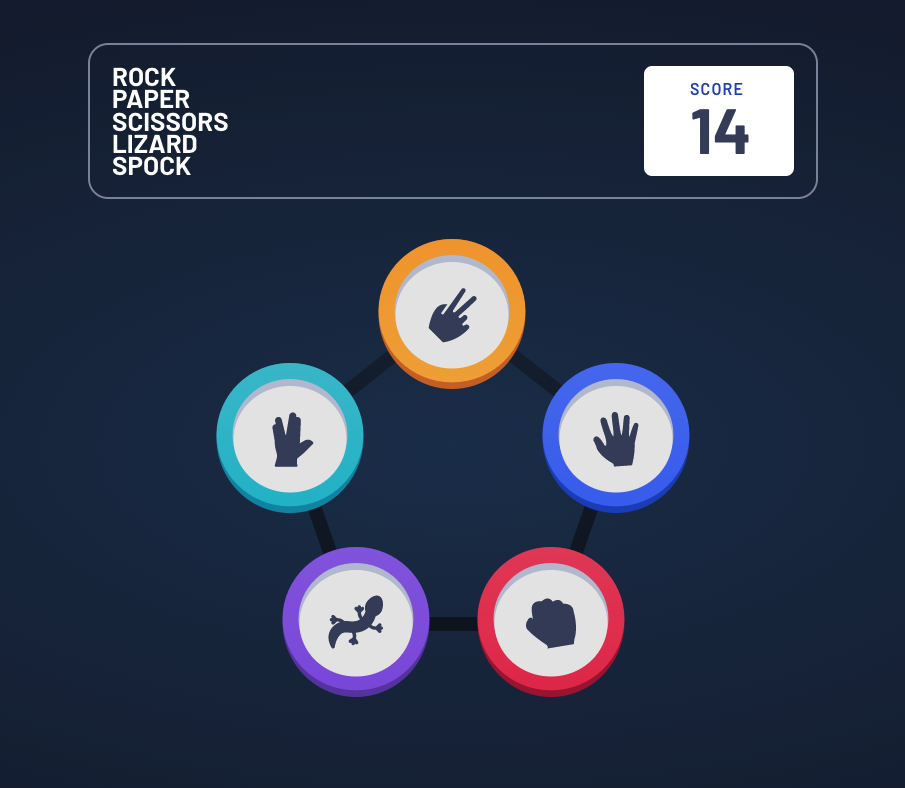

# Rock, Paper, Scissors, Lizard, Spock game

This is a solution to the [Rock, Paper, Scissors game challenge on Frontend Mentor](https://www.frontendmentor.io/challenges/rock-paper-scissors-game-pTgwgvgH).

## Table of contents

- [Overview](#overview)
  - [Functionality](#functionality)
  - [Screenshot](#screenshot)
  - [Link](#link)
- [My process](#my-process)
  - [Built with](#built-with)
  - [What I learned](#what-i-learned)
- [Author](#author)

## Overview

Rock, Paper, Scissors, Lizard, Spock game with vanilla js.

### Functionality

Users are able to:

- View the optimal layout for the game on desktop and mobile devices
- See animations and check rules
- Maintain the state of the score after refreshing the browser

### Screenshot

### Link

- Live Site URL: [Demo](https://wasatad.github.io/Rock-Paper-Scissors-Lizard-Spock/)

## My process

### Built with

- Vanilla JS

### What I learned

I improved understanding of positioning and animation in css and working with styles from js. Also I have got a practice in setting and getting data from local storage

## Author

- Frontend Mentor - [@Wasatad](https://www.frontendmentor.io/profile/Wasatad)
- Telegram - [@kuznetsovtm](https://t.me/@kuznetsovtm)
